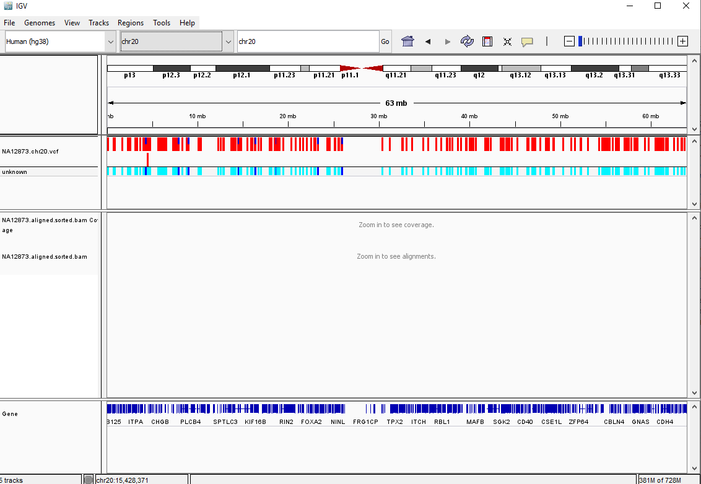

We mentioned before that we are working with files from the 1000 genomes project. Now that we have looked at our data to make sure that it is high quality, and removed low-quality base calls, we can perform variant calling to see how the population changed over time. We care what mutations these individuals have relative to a *healthy* individual.Therefore, we will align each of our samples to chromosome 20 of the human reference genome, and see what differences exist in our reads versus the genome.

# Alignment to a reference genome

We perform read alignment or mapping to determine where in the genome our reads originated from. There are a number of tools to
choose from and, while there is no gold standard, there are some tools that are better suited for particular NGS analyses. We will be
using the [Burrows Wheeler Aligner (BWA)](http://bio-bwa.sourceforge.net/), which is a software package for mapping low-divergent
sequences against a large reference genome. 

The alignment process consists of two steps:

1. Indexing the reference genome
2. Aligning the reads to the reference genome

# Setting up

First we download the reference genome for Human chromosome 20. Although we could copy or move the file with `cp` or `mv`, most genomics workflows begin with a download step, so we will practice that here. 

~~~
$ cd ~/dc_workshop
$ mkdir -p data/ref_genome
$ curl -L -o data/ref_genome/chr20.fa.gz https://hgdownload.soe.ucsc.edu/goldenPath/hg38/chromosomes/chr20.fa.gz
$ gunzip data/ref_genome/chr20.fa.gz
~~~
{: .bash}

> ## Downloading genome reference files
> For convenience, we have downloaded our reference file from the UCSC resource as it provides reference files on a per-chromosome basis. In pratice, you will probably want to download an entire genome for your variant calling. Moreover, you might have a reference organism other than human.
> Reference genomes for a variety of organisms can be found on [Ensembl](https://www.ensembl.org/Homo_sapiens/Info/Index).
{: .callout}

You will also need to create directories for the results that will be generated as part of this workflow. We can do this in a single
line of code, because `mkdir` can accept multiple new directory
names as input.

~~~
$ mkdir -p results/sam results/bam results/bcf results/vcf
~~~
{: .bash}

### Index the reference genome
Our first step is to index the reference genome for use by BWA. Indexing allows the aligner to quickly find potential alignment sites for query sequences in a genome, which saves time during alignment. Indexing the reference only has to be run once. The only reason you would want to create a new index is if you are working with a different reference genome or you are using a different tool for alignment.

~~~
$ module load BWA
$ bwa index data/ref_genome/chr20.fa
~~~
{: .bash}

While the index is created, you will see output that looks something like this:

~~~
[bwa_index] Pack FASTA... 0.44 sec
[bwa_index] Construct BWT for the packed sequence...
[BWTIncCreate] textLength=128888334, availableWord=21068624
[BWTIncConstructFromPacked] 10 iterations done. 34753182 characters processed.
[BWTIncConstructFromPacked] 20 iterations done. 64202446 characters processed.
[BWTIncConstructFromPacked] 30 iterations done. 90372990 characters processed.
[BWTIncConstructFromPacked] 40 iterations done. 113629422 characters processed.
[bwt_gen] Finished constructing BWT in 48 iterations.
[bwa_index] 23.96 seconds elapse.
[bwa_index] Update BWT... 0.37 sec
[bwa_index] Pack forward-only FASTA... 0.34 sec
[bwa_index] Construct SA from BWT and Occ... 12.16 sec
[main] Version: 0.7.17-r1188
[main] CMD: bwa index data/ref_genome/chr20.fa
[main] Real time: 39.114 sec; CPU: 37.271 sec
~~~
{: .output}

### Align reads to reference genome

The alignment process consists of choosing an appropriate reference genome to map our reads against and then deciding on an 
aligner. We will use the BWA-MEM algorithm, which is the latest and is generally recommended for high-quality queries as it 
is faster and more accurate.

An example of what a `bwa` command looks like is below. This command will not run, as we do not have the files `ref_genome.fa`, `input_file_R1.fastq`, or `input_file_R2.fastq`.

~~~
$ bwa mem ref_genome.fasta input_file_R1.fastq input_file_R2.fastq > output.sam
~~~
{: .bash}

Have a look at the [bwa options page](http://bio-bwa.sourceforge.net/bwa.shtml). While we are running bwa with the default 
parameters here, your use case might require a change of parameters. *NOTE: Always read the manual page for any tool before using 
and make sure the options you use are appropriate for your data.*

We're going to start by aligning the reads from just one of the 
samples in our dataset (`NA12873`). Later, we'll be 
iterating this whole process on all of our sample files.

~~~
$ bwa mem data/ref_genome/chr20.fa data/trimmed_fastq/NA12873_R1.trim.fq.gz data/trimmed_fastq/NA12873_R2.trim.fq.gz > results/sam/NA12873.aligned.sam
~~~
{: .bash}

You will see output that starts like this: 

~~~
[M::bwa_idx_load_from_disk] read 0 ALT contigs
[M::process] read 52688 sequences (4947578 bp)...
[M::mem_pestat] # candidate unique pairs for (FF, FR, RF, RR): (1, 24564, 0, 0)
[M::mem_pestat] skip orientation FF as there are not enough pairs
[M::mem_pestat] analyzing insert size distribution for orientation FR...
~~~
{: .output}

> ## Exercise 
> 
> Suppose we wanted to download fasta files for all chromosomes numbered 1 to 22. Can you suggest a for loop to download all these files? How would you then joing the files together into a single file? *You do not need to execute the loop as it will take too long to complete*
> 
>> ## Solution
>> 
>> ~~~
>> $ for i in 1:22
> do 
> curl -L -o data/ref_genome/chr${i}.fa.gz
> https://hgdownload.soe.ucsc.edu/goldenPath/hg38/chromosomes/chr${i}.fa.gz
> gunzip data/ref_genome/chr${i}.fa.gz
> done
> cat chr$.fa > hg38.fa
>> ~~~
>> {: .bash}
>> 
> {: .solution}
{: .challenge}

#### SAM/BAM format
The [SAM file](https://genome.sph.umich.edu/wiki/SAM),
is a tab-delimited text file that contains information for each individual read and its alignment to the genome. While we do not 
have time to go into detail about the features of the SAM format, the paper by 
[Heng Li et al.](http://bioinformatics.oxfordjournals.org/content/25/16/2078.full) provides a lot more detail on the specification.

**The compressed binary version of SAM is called a BAM file.** We use this version to reduce size and to allow for *indexing*, which enables efficient random access of the data contained within the file.

The file begins with a **header**, which is optional. The header is used to describe the source of data, reference sequence, method of
alignment, etc., this will change depending on the aligner being used. Following the header is the **alignment section**. Each line
that follows corresponds to alignment information for a single read. Each alignment line has **11 mandatory fields** for essential
mapping information and a variable number of other fields for aligner specific information. An example entry from a SAM file is 
displayed below with the different fields highlighted.

We will convert the SAM file to BAM format using the `samtools` program with the `view` command and tell this command that the input is in SAM format (`-S`) and to output BAM format (`-b`): 

~~~
$ module load SAMtools
$ samtools view -S -b results/sam/NA12873.aligned.sam > results/bam/NA12873.aligned.bam
~~~
{: .bash}

### Sort BAM file by coordinates

Next we sort the BAM file using the `sort` command from `samtools`. `-o` tells the command where to write the output.

~~~
$ samtools sort -o results/bam/NA12873.aligned.sorted.bam results/bam/NA12873.aligned.bam 
~~~
{: .bash}

Our files are pretty small, so we won't see this output. If you run the workflow with larger files, you will see something like this:
~~~
[bam_sort_core] merging from 2 files...
~~~
{: .output}

SAM/BAM files can be sorted in multiple ways, e.g. by location of alignment on the chromosome, by read name, etc. It is important to be aware that different alignment tools will output differently sorted SAM/BAM, and different downstream tools require differently sorted alignment files as input.

You can use samtools to learn more about this bam file as well.

~~~
samtools flagstat results/bam/NA12873.aligned.sorted.bam
~~~
{: .bash}

This will give you the following statistics about your sorted bam file:

~~~
52699 + 0 in total (QC-passed reads + QC-failed reads)
0 + 0 secondary
11 + 0 supplementary
0 + 0 duplicates
52695 + 0 mapped (99.99% : N/A)
52688 + 0 paired in sequencing
26344 + 0 read1
26344 + 0 read2
52514 + 0 properly paired (99.67% : N/A)
52680 + 0 with itself and mate mapped
4 + 0 singletons (0.01% : N/A)
0 + 0 with mate mapped to a different chr
0 + 0 with mate mapped to a different chr (mapQ>=5)

~~~
{: .output}

## Variant calling

A variant call is a conclusion that there is a nucleotide difference vs. some reference at a given position in an individual genome
or transcriptome, often referred to as a Single Nucleotide Polymorphism (SNP). The call is usually accompanied by an estimate of 
variant frequency and some measure of confidence. Similar to other steps in this workflow, there are a number of tools available for 
variant calling. In this workshop we will be using `freebayes`.

### Calling mutations for a single sample

We are going to use freebayes to call SNVs on some 1000 genomes samples. In order to make the SNV-calling run in a reasonable time, we are only considering reads aligned to chromosome 20 in this analysis. 

The minimal requirements to run `freebayes` (and why it is appealing for this practical!) are a reference genome and a `.bam` file. The -f parameter is used to specify the location of a reference genome in `.fasta` format.

A minimal command to call mutations on the sample `NA12873` is therefore:-

**Please don't run this command!**

~~~
$ freebayes -f data/ref_genome/chr20.fa results/bam/NA12873.aligned.sorted.bam
~~~
{: .bash}

If you did run that command, you would quickly see that the screen gets filled with lots of text. These are the calls that `freebayes` has making being printed to the screen (the standard output for some unix commands). If you find yourself in this situation, a swift press of CTRL + C should stop the tool from running.

What we need to do is direct the output to a file. We can call the output file anything we like, but it is advisable to make the name relatable to the name of the input. If we are in the situation of calling genotypes on many samples, with many different callers, then we want to be able to identify the processing used on each sample.

Although it is not mandatory, we give the output file the extension `.vcf`. The `.vcf` format is a commonly-adopted standard for variant calls, which we will look into detail next.

~~~
$ freebayes -f data/ref_genome/chr20.fa results/bam/NA12873.aligned.sorted.bam > results/vcf/NA12873.chr20.vcf
~~~
{: .bash}

## Explore the VCF format:

~~~
$ less -S results/vcf/NA12873.chr20.vcf
~~~
{: .bash}

You will see the header (which describes the format), the time and date the file was
created, the version of `freebayes` that was used, the command line parameters used, and 
some additional information:

~~~
##fileformat=VCFv4.2
##fileDate=20210628
##source=freeBayes v1.0.0
##reference=data/ref_genome/chr20.fa
##contig=<ID=chr20,length=64444167>
##phasing=none
##commandline="freebayes -f data/ref_genome/chr20.fa results/bam/NA12873.aligned.sorted.bam"
##INFO=<ID=NS,Number=1,Type=Integer,Description="Number of samples with data">
##INFO=<ID=DP,Number=1,Type=Integer,Description="Total read depth at the locus">
##INFO=<ID=DPB,Number=1,Type=Float,Description="Total read depth per bp at the locus; bases in reads overlapping / bases in haplotype">
##INFO=<ID=AC,Number=A,Type=Integer,Description="Total number of alternate alleles in called genotypes">
##INFO=<ID=AN,Number=1,Type=Integer,Description="Total number of alleles in called genotypes">
##INFO=<ID=AF,Number=A,Type=Float,Description="Estimated allele frequency in the range (0,1]">
##INFO=<ID=RO,Number=1,Type=Integer,Description="Count of full observations of the reference haplotype.">
##INFO=<ID=AO,Number=A,Type=Integer,Description="Count of full observations of this alternate haplotype.">

~~~
{: .output}

Followed by information on each of the variations observed: 

~~~
#CHROM  POS     ID      REF     ALT     QUAL    FILTER  INFO    FORMAT  unknown
chr20   147079  .       A       C       61.0529 .       AB=0;ABP=0;AC=2;AF=1;AN=2;AO=2;CIGAR=1X;DP=2;DPB=2;DPRA=0;EPP=7.35324;EPPR=0;GTI=0;LEN=1;MEANALT=1;MQM=60;MQMR=0;NS=1;NUMALT=1;ODDS=7.37776;PAIRED=1;PAIREDR=0;PAO=0;PQA=0;PQR=0;PRO=0;QA=77;QR=0;RO=0;RPL=1;RPP=3.0103;RPPR=0;RPR=1;RUN=1;SAF=1;SAP=3.0103;SAR=1;SRF=0;SRP=0;SRR=0;TYPE=snp GT:DP:AD:RO:QR:AO:QA:GL 1/1:2:0,2:0:0:2:77:-7.30914,-0.60206,0
chr20   777276  .       AA      ACA     42.7249 .       AB=0;ABP=0;AC=2;AF=1;AN=2;AO=2;CIGAR=1M1I1M;DP=2;DPB=3;DPRA=0;EPP=7.35324;EPPR=0;GTI=0;LEN=1;MEANALT=1;MQM=60;MQMR=0;NS=1;NUMALT=1;ODDS=7.37776;PAIRED=1;PAIREDR=0;PAO=0;PQA=0;PQR=0;PRO=0;QA=64;QR=0;RO=0;RPL=0;RPP=7.35324;RPPR=0;RPR=2;RUN=1;SAF=2;SAP=7.35324;SAR=0;SRF=0;SRP=0;SRR=0;TYPE=ins   GT:DP:AD:RO:QR:AO:QA:GL 1/1:2:0,2:0:0:2:64:-6.07837,-0.60206,0
chr20   777343  .       A       G       42.7277 .       AB=0;ABP=0;AC=2;AF=1;AN=2;AO=2;CIGAR=1X;DP=2;DPB=2;DPRA=0;EPP=7.35324;EPPR=0;GTI=0;LEN=1;MEANALT=1;MQM=60;MQMR=0;NS=1;NUMALT=1;ODDS=7.37776;PAIRED=1;PAIREDR=0;PAO=0;PQA=0;PQR=0;PRO=0;QA=64;QR=0;RO=0;RPL=2;RPP=7.35324;RPPR=0;RPR=0;RUN=1;SAF=2;SAP=7.35324;SAR=0;SRF=0;SRP=0;SRR=0;TYPE=snp       GT:DP:AD:RO:QR:AO:QA:GL 1/1:2:0,2:0:0:2:64:-6.07866,-0.60206,0
chr20   938451  .       A       G       57.2623 .       AB=0;ABP=0;AC=2;AF=1;AN=2;AO=2;CIGAR=1X;DP=2;DPB=2;DPRA=0;EPP=7.35324;EPPR=0;GTI=0;LEN=1;MEANALT=1;MQM=60;MQMR=0;NS=1;NUMALT=1;ODDS=7.37776;PAIRED=1;PAIREDR=0;PAO=0;PQA=0;PQR=0;PRO=0;QA=73;QR=0;RO=0;RPL=1;RPP=3.0103;RPPR=0;RPR=1;RUN=1;SAF=1;SAP=3.0103;SAR=1;SRF=0;SRP=0;SRR=0;TYPE=snp GT:DP:AD:RO:QR:AO:QA:GL 1/1:2:0,2:0:0:2:73:-6.93007,-0.60206,0
chr20   1708473 .       C       T       23.7579 .       AB=0;ABP=0;AC=2;AF=1;AN=2;AO=2;CIGAR=1X;DP=2;DPB=2;DPRA=0;EPP=7.35324;EPPR=0;GTI=0;LEN=1;MEANALT=1;MQM=60;MQMR=0;NS=1;NUMALT=1;ODDS=5.46562;PAIRED=1;PAIREDR=0;PAO=0;PQA=0;PQR=0;PRO=0;QA=44;QR=0;RO=0;RPL=0;RPP=7.35324;RPPR=0;RPR=2;RUN=1;SAF=0;SAP=7.35324;SAR=2;SRF=0;SRP=0;SRR=0;TYPE=snp       GT:DP:AD:RO:QR:AO:QA:GL 1/1:2:0,2:0:0:2:44:-4.17987,-0.60206,0
~~~
{: .output}

This is a lot of information, so let's take some time to make sure we understand our output.

The first few columns represent the information we have about a predicted variation. 

| column | info |
| ------- | ---------- |
| CHROM | contig location where the variation occurs | 
| POS | position within the contig where the variation occurs | 
| ID | a `.` until we add annotation information | 
| REF | reference genotype (forward strand) | 
| ALT | sample genotype (forward strand) | 
| QUAL | Phred-scaled probability that the observed variant exists at this site (higher is better) |
| FILTER | a `.` if no quality filters have been applied, PASS if a filter is passed, or the name of the filters this variant failed | 

In an ideal world, the information in the `QUAL` column would be all we needed to filter out bad variant calls.
However, in reality we need to filter on multiple other metrics. 

The last two columns contain the genotypes and can be tricky to decode. 

| column | info |
| ------- | ---------- |
| FORMAT | lists in order the metrics presented in the final column | 
| results | lists the values associated with those metrics in order | 

For our file, the metrics presented are GT:PL:GQ. 

| metric | definition | 
| ------- | ---------- |
| GT | the genotype of this sample which for a diploid genome is encoded with a 0 for the REF allele, 1 for the first ALT allele, 2 for the second and so on. So 0/0 means homozygous reference, 0/1 is heterozygous, and 1/1 is homozygous for the alternate allele. For a diploid organism, the GT field indicates the two alleles carried by the sample, encoded by a 0 for the REF allele, 1 for the first ALT allele, 2 for the second ALT allele, etc. |
| PL | the likelihoods of the given genotypes |
| GQ | the Phred-scaled confidence for the genotype | 
| AD, DP | the depth per allele by sample and coverage |

The Broad Institute's [VCF guide](https://www.broadinstitute.org/gatk/guide/article?id=1268) is an excellent place
to learn more about the VCF file format.

> ## Exercise
> 
> Use the `grep` and `wc` commands you've learned to assess how many variants are in the vcf file. 
>
>> ## Solution
>> 
>> ~~~
>> $ grep -v "#" results/vcf/NA12873.chr20.vcf | wc -l
>> ~~~
>> {: .bash}
>> 
>> ~~~ 
>> 218
>> ~~~
>> {: .output}
>>
>> There are 218 variants in this file.
> {: .solution}
{: .challenge}

## Assess the alignment (visualization) - optional step

It is often instructive to look at your data in a genome browser. Visualization will allow you to get a "feel" for 
the data, as well as detecting abnormalities and problems. Also, exploring the data in such a way may give you 
ideas for further analyses.  As such, visualization tools are useful for exploratory analysis. In this lesson we 
will describe two different tools for visualization: a light-weight command-line based one and the Broad
Institute's Integrative Genomics Viewer (IGV) which requires
software installation and transfer of files.

In order for us to visualize the alignment files, we will need to *index* the BAM file using `samtools`:

~~~
$ samtools index results/bam/NA12873.aligned.sorted.bam
~~~
{: .bash}

### Viewing with IGV

[IGV](http://www.broadinstitute.org/igv/) is a stand-alone browser, which has the advantage of being installed locally and providing fast access. Web-based genome browsers, like [Ensembl](http://www.ensembl.org/index.html) or the [UCSC browser](https://genome.ucsc.edu/), are slower, but provide more functionality. They not only allow for more polished and flexible visualization, but also provide easy access to a wealth of annotations and external data sources. This makes it straightforward to relate your data with information about repeat regions, known genes, epigenetic features or areas of cross-species conservation, to name just a few.

In order to use IGV, we will need to transfer some files to our local machine. We know how to do this with `scp`. 
Open a new tab in your terminal window and create a new folder. We'll put this folder on our Desktop for 
demonstration purposes, but in general you should avoid proliferating folders and files on your Desktop and 
instead organize files within a directory structure like we've been using in our `dc_workshop` directory.

~~~
$ mkdir ~/Desktop/files_for_igv
$ cd ~/Desktop/files_for_igv
~~~
{: .bash}

Now we will transfer our files to that new directory. Remember to replace the text between the `@` and the `:` 
with your AWS instance number. The commands to `scp` always go in the terminal window that is connected to your
local computer (not your AWS instance).

~~~
$ scp <your_username>@54.216.156.214:~/dc_workshop/results/bam/NA12873.aligned.sorted.bam ~/Desktop/files_for_igv
$ scp <your_username>@54.216.156.214:~/dc_workshop/results/bam/NA12873.aligned.sorted.bam.bai ~/Desktop/files_for_igv
$ scp <your_username>@54.216.156.214:~/dc_workshop/results/vcf/NA12873.chr20.vcf ~/Desktop/files_for_igv
~~~
{: .bash}

Next, we need to open the IGV software. If you haven't done so already, you can download IGV from the [Broad Institute's software page](https://www.broadinstitute.org/software/igv/download), double-click the `.zip` file
to unzip it, and then drag the program into your Applications folder. 

1. Open IGV.
2. Load our BAM file (`NA12873.aligned.sorted.bam`) using the **"Load from File..."** option under the **"File"** pull-down menu. 
3.  Do the same with our VCF file (`NA12873.chr20.vcf`).

Your IGV browser should look like the screenshot below:

There should be two tracks: one corresponding to our BAM file and the other for our VCF file. 

In the **VCF track**, each bar across the top of the plot shows the allele fraction for a single locus. The second bar shows
the genotypes for each locus in each *sample*. We only have one sample called here, so we only see a single line. Dark blue = 
heterozygous, Cyan = homozygous variant, Grey = reference.  Filtered entries are transparent.

Zoom in to inspect variants you see in your filtered VCF file to become more familiar with IGV. See how quality information 
corresponds to alignment information at those loci.
Use [this website](http://software.broadinstitute.org/software/igv/AlignmentData) and the links therein to understand how IGV colors the alignments.

## Filter the variants

By default, `freebayes` reports all possible variants and the calls it makes may be of varying quality. Even though we have previously trimmed unreliable bases from our dataset we may still identify positions that look like they are mutations, but are in fact artefects. `freebayes` assigns a *quality* score to each call that it makes and these can be used to filter the results. The quality scores are not particularly easy to interpret or assign a cut-off to; except that a lower quality means a mutation with less evidence to support it.

The [`vcftools`](https://vcftools.github.io/index.html) suite of software allows various filtering operations to be performed. For this workshop we will remove all variants below an acceptable threshold, but in practice other filters should be applied such as requiring a minimum *depth* of sequencing. We cannot apply such a filter her due to the restricted nature of our dataset.

~~~
module load VCFtools
vcftools --vcf results/vcf/NA12873.chr20.vcf -minQ 20 --recode --recode-INFO-all --out results/vcf/NA12873.chr20_final.vcf
~~~
{:bash}

Depending on our application, we might also want to discard variants that are common in healthy individuals. Researchers often want to prioritise mutations that are likely to have biological consequences. We can only these types of question once we have annotated our calls against databases of previously identified mutations.

## Variant Annotation

### Why do we need to *annotate* our variants?

- Can have huge list of variants after SNV-calling
  + in the order of *millions* even after filtering
- Not all will have consequences for the individual
- Need to functionally annotate biological and biochemical function
- Determine which variants have been previously-identified
in previous studies
  + amongst healthy / diseased individuals

There are many annotation resources available, but we have chosen to demonstrate `annovar`. There is an overhead associated with downloading the required annotation files, and a lot of disk space is consumed. However, you will hopefully agree that once configured it is relatively easy to use. `annovar` is a suite of `perl` scripts that can perform a variety of annotation and filtering tasks. It can also collate the results from annotating against different databases into one convenient table.

Let's create a directory for our annotated results

~~~
mkdir -p ~/dc_workshop/results/vcf_annotated
~~~
{:bash}

`annovar` requires input files to be in a specific format, which we do not currently have. Fortunately, it provides a script that can convert from vcf to its own format; `convert2annovar.pl`. We will use this script to put an annovar-compatible file in the `vcf_annotated` directory

~~~
cd ~/dc_workshop/results/vcf_annotated
module load annovar
convert2annovar.pl -format vcf4 ../vcf/NA12873.chr20_final.vcf > NA12873.avinput
~~~
{: .bash}

The main annovar script is called `annotate_variation.pl` and the operations it can be performed are summarised by running the script without any options. Some example commands are given at the bottom of the text that is displayed.

~~~
annotate_variation.pl
~~~
{: .bash}

`annovar` can compare the variant positions in our data to a whole host of [pre-built databases](https://annovar.openbioinformatics.org/en/latest/user-guide/filter/#summary-of-databases). None are supplied with the software itself and they have to be downloaded by the user.

We can downloaded some files for this workshop to save time. For reference, the commands that were used are given below (you would need to un-comment the code in order to re-run).

~~~
##annotate_variation.pl -downdb -buildver hg38 refGene humandb
##annotate_variation.pl --buildver hg38 --downdb seq humandb/hg38_seq
##retrieve_seq_from_fasta.pl humandb/hg38_refGene.txt -seqdir humandb/hg38_seq -format refGene -outfile humandb/hg38_refGeneMrna.fa

~~~
{: .bash}

A fundamental question is whether our variants occur within genomic regions that are translated into *genes* or not. Variants in these regions are more likely to have consequences as, for example, they can lead to alternative amino acids being produced. We might also want to known whether any variants occur within genes that are known to be implicated with disease. To annotate against known gene positions we can use the `-geneanno` operation. This will use a database that has been downloaded. For this workshop we downloaded such files to `/mnt/shared/annovar_db/humandb/`.

~~~
annotate_variation.pl -geneanno -buildver hg38 NA12873.avinput /mnt/shared/annovar_db/humandb
~~~
{: .bash}

> ## Exercise
> 
> What files did the previous command create? Use the [documentation from annovar](https://annovar.openbioinformatics.org/en/latest/user-guide/gene/) to find out more about them .
>
>> ## Solution
>> 
>> ~~~
>> $ ls -lrt
>> ~~~
>> {: .bash}
>> 
>> ~~~ 
>> -rw-r--r--. 1 markd users  9034 Jul  3 17:23 NA12873.avinput
>> -rw-r--r--. 1 markd users 16949 Jul  3 17:24 NA12873.avinput.variant_function
>> -rw-r--r--. 1 markd users    63 Jul  3 17:24 NA12873.avinput.exonic_variant_function
>> -rw-r--r--. 1 markd users   976 Jul  3 17:24 NA12873.avinput.log
>> ~~~
>> {: .output}
>>
>> exonic and variant function files are created. Any variants that occur within coding (exon) regions are in the exonic files. All other variants appear in the variant function and categorised according to their closest gene.
> {: .solution}
{: .challenge}

The `annotate_variation.pl` script can be applied in this manner to other databases that we have downloaded which will quickly result in a large number of files in the directory.

The `table_annovar.pl` script can annotate against multiple sources and compile the results into a convenient table for further investigation. The below command will annotate against 1000 genomes, COSMIC and various databases that can assign clinical significance. A `.csv` file is created that can be copied locally and opened in Excel.

~~~
table_annovar.pl NA12873.avinput /mnt/shared/annovar_db/humandb -buildver hg38 -out NA12873_final -remove -protocol refGene,1000g2015aug_all,cosmic70,dbnsfp30a -operation g,f,f,f -nastring NA -csvout

~~~
{: .bash}

## Next steps

Now that we've run through our workflow for a single sample, we want to repeat this workflow for our other five
samples. However, we don't want to type each of these individual steps again five more times. That would be very
time consuming and error-prone, and would become impossible as we gathered more and more samples. Luckily, we
already know the tools we need to use to automate this workflow and run it on as many files as we want using a
single line of code. Those tools are: wildcards, for loops, and bash scripts. We'll use all three in the next 
lesson. 

> ## Installing Software
> 
> It's worth noting that all of the software we are using for
> this workshop has been pre-installed on our remote computer. 
> This saves us a lot of time - installing software can be a 
> time-consuming and frustrating task - however, this does mean that
> you won't be able to walk out the door and start doing these
> analyses on your own computer. You'll need to install 
> the software first. Look at the [setup instructions](http://www.datacarpentry.org/wrangling-genomics/setup.html) for more information 
> on installing these software packages.
{: .callout}

> ## BWA Alignment options
> BWA consists of three algorithms: BWA-backtrack, BWA-SW and BWA-MEM. The first algorithm is designed for Illumina sequence 
> reads up to 100bp, while the other two are for sequences ranging from 70bp to 1Mbp. BWA-MEM and BWA-SW share similar features such 
> as long-read support and split alignment, but BWA-MEM, which is the latest, is generally recommended for high-quality queries as it 
> is faster and more accurate. 
{: .callout}

